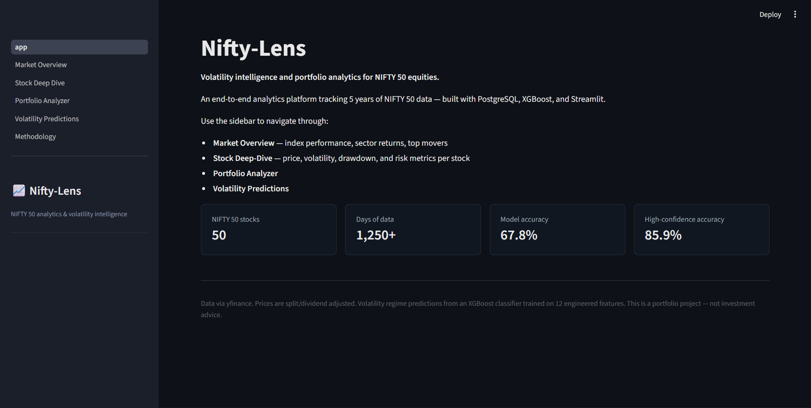
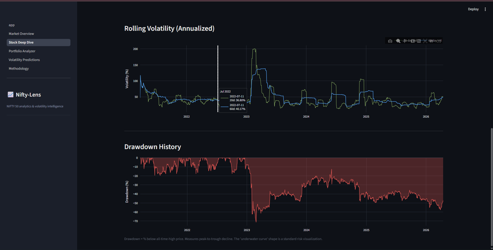
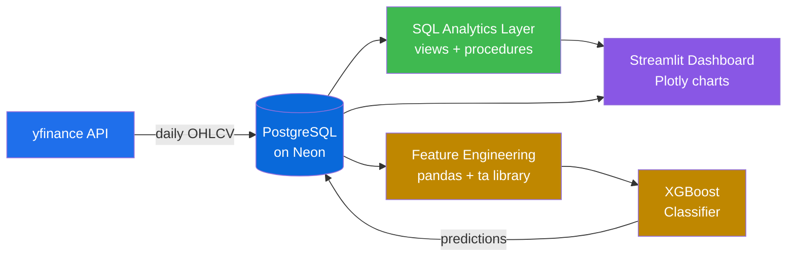

# 📈 Nifty-Lens

Volatility intelligence and portfolio analytics for NIFTY 50 equities.

🔗 **[Try it live →](https://nifty-lens.streamlit.app)**

An end-to-end analytics platform: PostgreSQL backend with materialized views and stored procedures, an XGBoost classifier predicting next-5-day volatility regimes, and a Streamlit dashboard wiring it all together. Five years of daily NIFTY 50 data, 67.8% model accuracy on a 3-class classification problem (33% random baseline), and 86% accuracy on the high-confidence subset.

---

## Dashboard



The app has five pages. **Market Overview** shows NIFTY 50 index history, a sector YTD heatmap, and top movers across configurable time periods. **Stock Deep-Dive** drills into a single ticker with a price chart overlaying 50/200-day moving averages, rolling volatility, and a drawdown underwater plot. **Portfolio Analyzer** lets you build custom portfolios with weight sliders and returns annualized return, volatility, Sharpe, max drawdown, and sector exposure (computed via PostgreSQL stored procedures). **Volatility Predictions** visualizes the XGBoost classifier — current predictions for all 50 stocks, confusion matrix, calibration analysis, and per-ticker prediction history. **Methodology** documents the design decisions and key findings.



---

## Architecture



Built with PostgreSQL (Neon serverless), Python, pandas, the `ta` technical analysis library, scikit-learn, XGBoost, Streamlit, and Plotly. Data comes from yfinance and is split/dividend-adjusted for return calculations. The full pipeline runs end-to-end via `scripts/refresh_pipeline.py`.

---

## The most important finding

The single most impactful decision in this project was the choice of prediction horizon. The initial model targeted **next-day volatility** and achieved 39% accuracy — barely above the 33% random baseline. Single-day moves are dominated by idiosyncratic noise. Reframing the target to **next-5-day average volatility** moved accuracy to 67.8%, a 29-percentage-point jump from changing one line of code.

This aligns with the well-documented _volatility clustering_ phenomenon in finance: realized volatility is much more autocorrelated over 3-10 day windows than over single days. Hyperparameter tuning across seven configurations moved accuracy by less than 0.5 percentage points. **Target horizon mattered far more than model complexity.**

---

## Calibration matters more than headline accuracy

The classifier is well-calibrated: when it reports >70% confidence, it's right 86% of the time across 4,874 test predictions (40% of the test set). Predictions in the 60-70% confidence band hit 63%, 50-60% hit 53%, and below 50% the model is essentially uncertain (49.8% accuracy on those — close to random for the cases the model itself flags as low-confidence).

In production this means you can apply a confidence threshold and get genuinely high-quality predictions on a meaningful fraction of inputs, with honest uncertainty on the rest. That tiered behavior is arguably more valuable than the headline number.

---

## Local setup

Requires Python 3.11+ and a PostgreSQL database (this project uses Neon's free tier).

```bash
git clone https://github.com/adrenaline03/nifty-lens.git
cd nifty-lens
python -m venv venv
source venv/bin/activate   # Windows: venv\Scripts\activate
pip install -r requirements.txt
cp .env.example .env       # then edit .env with your Postgres credentials
```

Then run the full pipeline:

```bash
python scripts/refresh_pipeline.py
streamlit run streamlit_app/app.py
```

Or run individual stages — see `scripts/refresh_pipeline.py` for the order. Skip flags `--skip-ingest` and `--skip-ml` are available for partial reruns.

---

## Disclaimer

This is a portfolio project. It is not investment advice. All metrics use historical data; past performance does not predict future results. Transaction costs, slippage, and taxes are not modeled.
