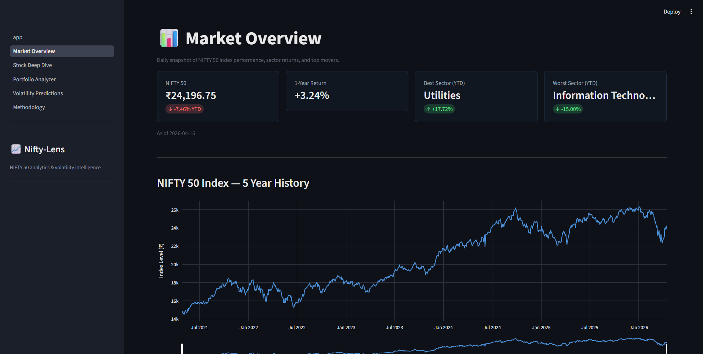
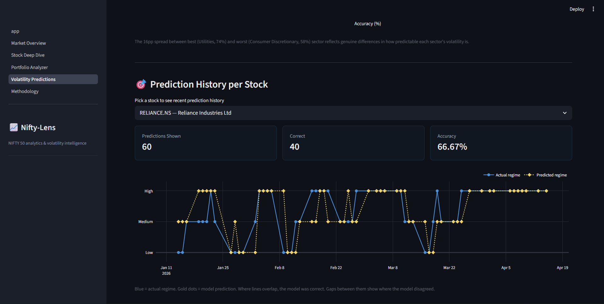
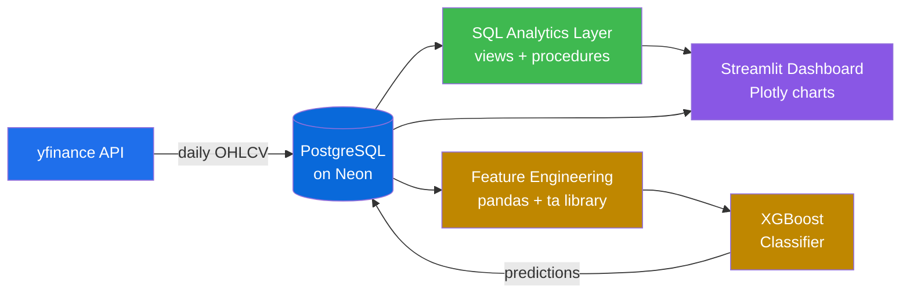

# 📈 Nifty-Lens

> **Volatility intelligence and portfolio analytics for NIFTY 50 equities.**
> An end-to-end analytics platform: PostgreSQL → ML pipeline → live Streamlit dashboard.

🔗 **Live demo:** _Deploying on Day 9 — link coming soon_
📂 **Source:** [github.com/adrenaline03/nifty-lens](https://github.com/adrenaline03/nifty-lens)

---

## 🎯 Project Highlights

| Metric                       | Value                                            |
| ---------------------------- | ------------------------------------------------ |
| **Stocks tracked**           | 50 (full NIFTY 50 index)                         |
| **Data history**             | 5 years of daily OHLCV                           |
| **ML feature rows**          | 59,763 across 50 tickers                         |
| **Model accuracy**           | 67.80% on next-5-day volatility regime (3-class) |
| **High-confidence accuracy** | 85.95% on 40% of test predictions                |
| **Random baseline**          | 33.33%                                           |

---

## 🖼️ Dashboard Preview

### Home


### Market Overview



### Stock Deep-Dive


### Volatility Predictions



---

## 🏗️ Architecture



---

## 💡 Key Technical Finding

The **single most impactful decision** in this project was the choice of prediction horizon.

- **Initial target:** next-day volatility regime → **39% accuracy** (barely above 33% random baseline)
- **Reframed target:** next-5-day average volatility → **67.8% accuracy** (29-pp jump)

A single-line code change — replacing `.shift(-1)` with `.shift(-1).rolling(5).mean()` —
delivered all of that gain. Single-day volatility is dominated by idiosyncratic noise,
while 5-day windows capture _volatility clustering_: a well-documented phenomenon
where past volatility predicts future volatility much more reliably over 3-10 day horizons.

**The lesson: target horizon mattered more than model complexity.** Hyperparameter
tuning across 7 configurations moved accuracy by less than 0.5pp.

---

## 🔍 Calibration Beats Raw Accuracy

The 67.8% headline understates the model's usefulness. The classifier is **well-calibrated**:

| Confidence Bucket | Actual Accuracy | Predictions |
| ----------------- | --------------- | ----------- |
| < 40%             | 28.6%           | 7           |
| 40–50%            | 49.8%           | 1,385       |
| 50–60%            | 53.2%           | 3,684       |
| 60–70%            | 63.5%           | 2,142       |
| **≥ 70%**         | **86.0%**       | **4,874**   |

Predicted probabilities reflect real accuracy. In production, a confidence threshold
gives users 86% accuracy on 40% of all predictions — and honest uncertainty on the rest.

---

## 🛠️ Tech Stack

| Layer                   | Tools                                                              |
| ----------------------- | ------------------------------------------------------------------ |
| **Database**            | PostgreSQL (Neon serverless)                                       |
| **Ingestion**           | Python, yfinance, SQLAlchemy                                       |
| **Analytics**           | SQL views, materialized views, pl/pgsql stored functions           |
| **Feature Engineering** | pandas, `ta` (Technical Analysis library)                          |
| **ML**                  | XGBoost, scikit-learn (with `TimeSeriesSplit` for walk-forward CV) |
| **Visualization**       | Streamlit, Plotly                                                  |
| **Orchestration**       | Custom Python pipeline with idempotent steps                       |

---

## 🚀 Quickstart

### Prerequisites

- Python 3.11+
- PostgreSQL access (this project uses Neon's free tier)

### Setup

```bash
# Clone the repo
git clone https://github.com/adrenaline03/nifty-lens.git
cd nifty-lens

# Create venv
python -m venv venv
source venv/bin/activate   # On Windows: venv\Scripts\activate

# Install dependencies
pip install -r requirements.txt

# Configure database connection
cp .env.example .env
# Edit .env with your Postgres credentials
```

### Run the pipeline

```bash
# 1. Create schema and ingest data
python setup_db.py
python src/load_constituents.py
python src/ingest_prices.py
python src/ingest_index.py

# 2. Apply analytics layer
python apply_views.py sql/views.sql
python apply_procedures.py sql/procedures.sql

# 3. Build ML features and train model
python src/features.py
python src/train_model.py
python src/evaluate_model.py

# 4. Apply prediction views
python apply_views.py sql/predictions_views.sql

# 5. Launch the dashboard
streamlit run streamlit_app/app.py
```

### Or run the full pipeline at once

```bash
python scripts/refresh_pipeline.py
```

Flags: `--skip-ingest` to use existing data, `--skip-ml` to skip feature/prediction rebuild.

---

## 📚 Methodology

For the full project narrative — design decisions, ML approach, calibration analysis,
and known limitations — visit the **Methodology** page in the live dashboard, or read
the training notebook at `notebooks/02_model_training.ipynb`.

### Standard Assumptions

- 252 trading days per year
- 6.5% annualized risk-free rate (Indian 10-year G-Sec)
- Per-ticker volatility tertiles (low/medium/high regime boundaries are stock-specific)
- Adjusted close prices for all return calculations
- Time-based train/test split (4 years train, 1 year test) — no shuffling

---

## 📊 Data Scope

- 49 full-history NIFTY 50 constituents (5 years of daily OHLCV)
- **TMPV.NS** — partial history (post-October 2025 demerger)
- **ETERNAL.NS** — partial history (Zomato IPO July 2021)
- NIFTY 50 index (5 years)

---

## ⚖️ Disclaimer

This is a portfolio project for demonstrating analytics and ML engineering skills.
**It is not investment advice.** All metrics are based on historical data; past
performance does not predict future results. Transaction costs, taxes, and
market impact are not modeled.
